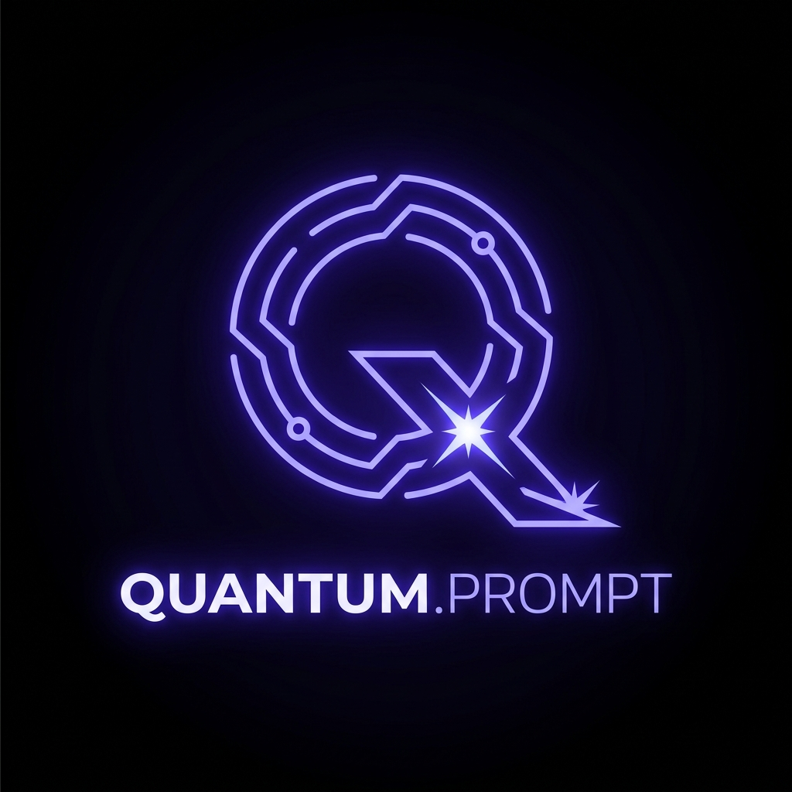
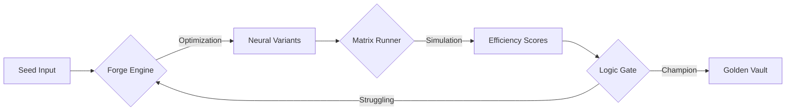

<div align="center">
  
  <h1>🌌 QUANTUM COMMAND v7.1</h1>
  <p><b>Elite Autonomous Prompt Intelligence & Optimization Suite</b></p>
  <p><i>The gold standard for high-performance AI signal architecture.</i></p>

  
  
  
</div>

---

## 🏛️ Project Philosophy
In the era of Generative AI, the **Prompt** is the new source code. Most toolkits treat prompting as a simple text exercise; **Quantum Command** treats it as a high-fidelity signal engineering discipline. By combining **autonomous AI optimization** with **multi-model benchmarking**, we enable researchers to find the "Champion Signal" that maximizes both logical precision and neural efficiency.

---

## 🚀 Key Innovation Pillars

### 1. ⚡ Neural Forge & Tactical Nexus
The Forge is where signal architecture begins. Unlike standard editors, it features a **Nexus**—a version-controlled workspace that tracks the "lineage" of a prompt. 
- **Lineage Tracking**: Every version (v1, v2, v3...) is archived with its creation date and efficiency score.
- **Autonomous Evolution**: Our AI Optimizer uses a three-pronged strategy to expand seed prompts into specialized variants (Chain-of-Thought, Professional, and Edge-Case Creative).

### 2. 🧪 Tactical Recipes Hub
Inject world-class prompt engineering patterns into your workspace with a single click:
- **🧠 Chain-of-Thought**: Forces explicit reasoning phases.
- **⚖️ Self-Critique**: Implements an internal feedback loop for accuracy.
- **📦 Structural JSON**: Automates complex schema enforcement.
- **👤 Persona Injection**: Calibrates the AI substrate for senior-expert roles.

### 3. 🛰️ Matrix Runner (Multi-Model simulation)
The Matrix Runner is a high-performance simulation environment. It allows you to:
- **Cross-Benchmark**: Run the same prompt against multiple models (Llama 70B, 8B, etc.) simultaneously.
- **Auto-Compare**: Automatically identifies the "Champion" variant based on a proprietary 15-point efficiency scale.

---

## 🛰️ Technical Architecture

### **The Signal Pipeline**


### **File Substrate Map**
| Layer | Component | Core Function |
| :--- | :--- | :--- |
| **Logic** | `app.js` | Orchestrates the child process execution and AI optimization. |
| **Engine** | `scoring.js` | Calculates efficiency based on latency, logic, and safety metrics. |
| **AI** | `lib/aiOptimizer.js` | Uses Llama-3.3 to autonomously evolve prompt variations. |
| **Data** | `data/` | Symmetrical storage (JSON fallback) ensuring 100% uptime. |
| **UI** | `app/page.js` | The Quantum Command Center—built with premium Glassmorphism. |

---

## ⚙️ Engineering Setup

### **Environmental Calibration**
Create a `.env.local` file in the root directory:
```env
# Required for AI Optimization & Inference
GROQ_API_KEY=your_high_speed_api_key

# Optional: MongoDB Integration
MONGODB_URI=your_cluster_address
```

### **Deployment Command Sequence**
1. **Synchronize Substrate**:
   ```bash
   npm install
   ```
2. **Initiate Dev-Matrix**:
   ```bash
   npm run dev
   ```
3. **Access Command Center**:
   Open [http://localhost:3000](http://localhost:3000)

---

## 🧬 Tactical Guide: Finding the Champion
1. **Initialize**: Paste your base prompt in the **Neural Forge**.
2. **Evolve**: Click **Turbo-Optimize** to generate 3 specialized AI variations.
3. **Refine**: Use **Tactical Recipes** (like Self-Critique) to polish the best version.
4. **Stress-Test**: Go to the **Matrix Runner**, enter a complex test input, and run the simulation.
5. **Archive**: The winner is automatically saved to the **Golden Signal Vault** with its peak AI response and identity ID.

---

## 🛡️ Security & Performance
- **Zero-Data Loss**: If MongoDB is unreachable, the system automatically redirects signal traffic to the `data/` JSON registry.
- **Cinematic Performance**: Optimized Next.js 14 architecture with CSS-hardware acceleration for background animations.
- **Latency Monitoring**: Every run is timed to the millisecond to ensure production readiness.

---

## 📄 License & Distribution
**QUANTUM COMMAND** is a proprietary research tool designed by **Elite AI Solutions**. Unauthorized distribution of the Neural Substrate is prohibited. 🛰️
