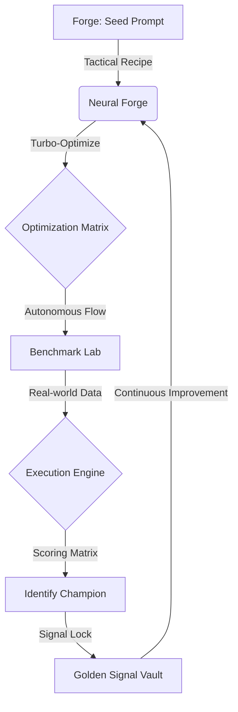

# 🌌 Quantum Command v7.0: Elite Prompt Intelligence Suite

**Quantum Command** is a state-of-the-art, autonomous prompt engineering laboratory designed for the next generation of AI research. It provides a premium, commercial-grade environment for architecting, benchmarking, and archiving high-performance neural signals.


---

## 🛰️ Core Features

*   **⚡ Neural Forge (v7.0)**: Sub-second prompt cluster creation with integrated **Tactical Recipes** for Chain-of-Thought, Self-Critique, and Persona injection.
*   **🛰️ Matrix Runner**: Simulates prompt performance across multiple models simultaneously (Llama-3, Mixtral, Elite-8B) with side-by-side efficiency benchmarking.
*   **🧠 Autonomous Neural Optimizer**: One-click expansion into 3 high-performance variations (Chain-of-Thought, Professional, Creative).
*   **🛡️ Golden Signal Vault**: Persistent archival of your highest-scoring prompts, including the peak AI response reference.
*   **🧬 Core Metrics Dashboard**: Real-time visualization of signal strength, latency distribution, and architectural stability.
*   **🌌 Cinematic UI/UX**: Premium glassmorphism design system with animated neural backgrounds and effortless navigation.

---

## 🧪 Operational Workflow

The Quantum Command workflow is designed as a closed-loop optimization cycle:



1.  **Forge Phase**: Initialize your signal seed and apply tactical reasoning recipes.
2.  **Benchmark Phase**: Stress-test variations across the intelligence matrix using real-world datasets.
3.  **Archival Phase**: Commit only the most efficient signals (Champions) to the production library.

---

## 📑 Project Structure

```bash
├── 📁 app/                 # Next.js Application Core
│   ├── 📁 api/             # High-Performance API Substrate
│   │   ├── 📁 analytics/   # Metric Aggregation Services
│   │   ├── 📁 run/         # Matrix Execution Engine
│   │   └── 📁 prompts/     # Neural Signal Management
│   ├── 📄 globals.css      # Quantum Design System (v7.0)
│   └── 📄 page.js          # Unified Command Center UI
├── 📁 data/                # Persistent Local Storage (JSON Fallback)
├── 📁 lib/                 # Core Intelligence Logic
│   ├── 📄 aiOptimizer.js   # Autonomous Variation Generator
│   ├── 📄 parser.js        # Benchmark Signal Parser
│   └── 📄 db.js            # MongoDB Symmetrical Bridge
├── 📁 models/              # Mongoose Schema Definitions
├── 📄 app.js               # Orchestration Layer (Node.js Processor)
├── 📄 scoring.js           # Efficiency Calculation Logic
└── 📄 public/              # Cinematic Assets & Logotypes
```

---

## 🛠️ System Requirements

*   **Backend Substrate**: Node.js 18+ / npm
*   **Database**: MongoDB (Local JSON Fallback enabled)
*   **Intelligence Source**: Groq API Key (Llama-3.3-70B recommended)
*   **Framework**: Next.js 14+ (App Router)

---

## ⚡ Quick Start

1.  **Clone the matrix**:
    ```bash
    git clone https://github.com/onkarswamii/prompt-toolkit.git
    cd prompt-toolkit
    ```
2.  **Synchronize Dependencies**:
    ```bash
    npm install
    ```
3.  **Inject Neural Key**:
    Add `GROQ_API_KEY` to your `.env.local`.
4.  **Initiate Protocol**:
    ```bash
    npm run dev
    ```

---

## 🧬 Tactical Specs

| Specification | Value |
| :--- | :--- |
| **Model Focus** | Llama-3.3-70B-Versatile |
| **Scoring Scale** | 0-15 (Efficiency, Logic, Safety) |
| **UI Design** | Cinematic Glassmorphism v7.0 |
| **Persistence** | Symmetrical (Mongo + JSON Fallback) |
| **Intros** | Animated Quantum Cinematic Logo Sequence |

---

## 📄 License
**QUANTUM.PROMPT** is licensed under private distribution for Elite AI Research. 🚀
